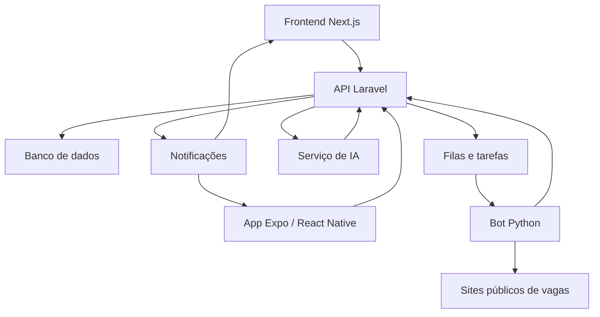
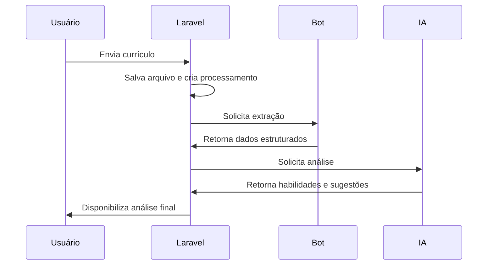
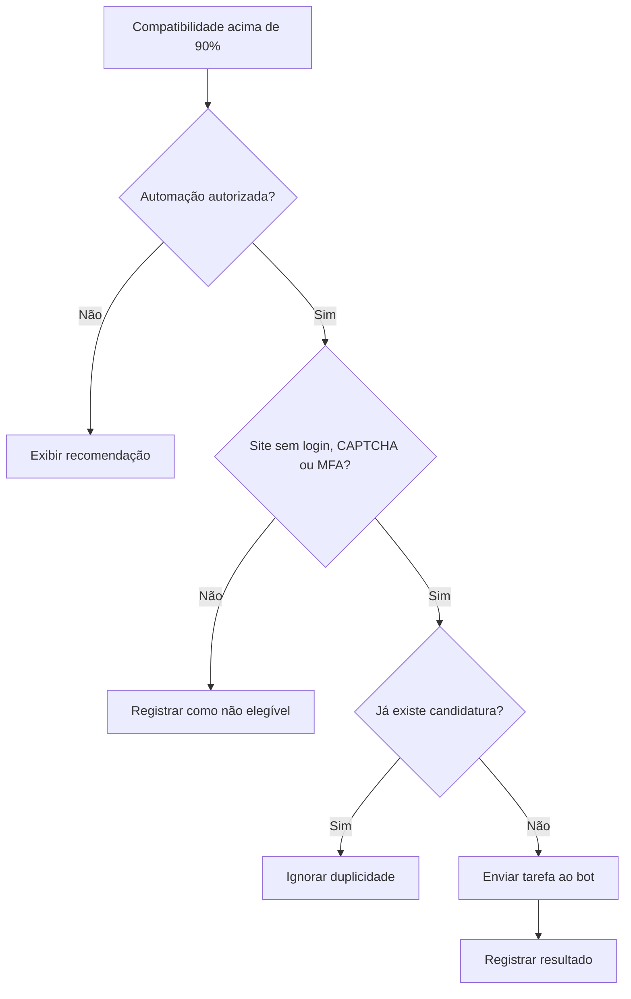

# Talora Apply

## Documento de visão, arquitetura e funcionamento

**Status:** Documento-base para evolução do produto  
**Versão:** 0.1  
**Data:** 30 de julho de 2026

---

## 1. Visão do produto

O **Talora Apply** é um agente inteligente de carreira criado para ajudar o usuário a encontrar vagas compatíveis com seu perfil profissional, compreender como seu currículo se relaciona com cada oportunidade e realizar candidaturas de forma automatizada quando as regras do produto permitirem.

O sistema não deve funcionar apenas como um buscador de vagas. Seu objetivo é acompanhar o ciclo completo:

1. receber e processar o currículo do usuário;
2. identificar experiências, habilidades e objetivos profissionais;
3. pesquisar vagas publicadas na internet;
4. normalizar e analisar os requisitos de cada vaga;
5. calcular a compatibilidade entre candidato e oportunidade;
6. explicar o resultado da classificação;
7. sugerir melhorias no currículo e no perfil;
8. efetuar candidaturas automáticas quando a compatibilidade e o site permitirem;
9. registrar e acompanhar o histórico das candidaturas.

O Talora é a marca principal. **Talora Apply** é o produto responsável pela busca, análise e candidatura em vagas.

---

## 2. Problema que o sistema resolve

Uma busca de emprego normalmente exige que o candidato:

- procure vagas repetidamente em diversos sites;
- leia descrições extensas e pouco padronizadas;
- compare manualmente os requisitos com o próprio currículo;
- preencha formulários semelhantes várias vezes;
- acompanhe onde e quando se candidatou;
- descubra sozinho por que seu perfil não parece compatível com determinadas vagas.

O Talora Apply centraliza e automatiza parte desse processo. O usuário continua controlando seus dados e objetivos, enquanto o sistema executa o trabalho repetitivo e apresenta informações claras para ajudá-lo a evoluir profissionalmente.

---

## 3. Escopo funcional

### 3.1 Autenticação

O sistema possui:

- cadastro de usuário;
- login;
- recuperação de senha;
- logout;
- autenticação por token utilizando Laravel Sanctum;
- proteção das rotas privadas no frontend e no aplicativo mobile.

O cadastro apenas cria a conta. Ele não autentica automaticamente. Depois do cadastro, o usuário recebe uma mensagem de sucesso e é direcionado para realizar o login.

### 3.2 Currículo

O usuário poderá:

- enviar o primeiro currículo;
- manter versões do currículo;
- selecionar qual currículo será utilizado nas pesquisas;
- visualizar o status do processamento;
- receber uma análise estruturada;
- consultar sugestões de melhoria;
- acompanhar habilidades identificadas e pontos ausentes.

### 3.3 Pesquisa de vagas

A pesquisa acontece somente quando iniciada pelo usuário.

O usuário informa cargos, palavras-chave e filtros. O backend cria uma pesquisa assíncrona, e o bot consulta os provedores suportados.

Durante o processamento, o sistema deve informar:

- que a pesquisa foi iniciada;
- quais fontes estão sendo processadas;
- quantas vagas foram encontradas;
- quantas foram descartadas;
- quantas foram classificadas;
- quantas ficaram elegíveis para candidatura;
- quantas candidaturas foram realizadas;
- eventuais falhas que necessitem de atenção.

### 3.4 Classificação candidato-vaga

Cada vaga recebe uma pontuação de compatibilidade baseada no currículo e no perfil do usuário.

Uma proposta inicial de faixas é:

| Pontuação | Interpretação | Ação |
| --- | --- | --- |
| Abaixo de 70% | Baixa compatibilidade | Não se candidatar automaticamente |
| De 70% até 90% | Compatibilidade relevante | Exibir como recomendação para análise do usuário |
| Acima de 90% | Alta compatibilidade | Candidatura automática, quando todas as demais regras forem atendidas |

A pontuação não deve ser uma resposta sem explicação. O sistema deve mostrar os fatores que contribuíram positiva e negativamente para o resultado.

### 3.5 Candidatura automática

A candidatura automática somente poderá ocorrer quando:

- a compatibilidade for superior a 90%;
- o usuário tiver autorizado a automação;
- o site não exigir login;
- o site não exigir CAPTCHA, MFA ou outro mecanismo de verificação humana;
- o formulário puder ser preenchido com os dados autorizados pelo usuário;
- o usuário ainda não tiver se candidatado à mesma vaga;
- a vaga ainda estiver disponível;
- o provedor estiver habilitado e funcionando;
- nenhuma informação obrigatória estiver ausente.

O bot não deverá tentar contornar login, CAPTCHA, MFA, bloqueios ou mecanismos de proteção dos sites.

Quando uma candidatura não puder ser concluída, o sistema deverá registrar o motivo e informar ao usuário, em vez de ocultar a falha.

---

## 4. Responsabilidade de cada tecnologia

### 4.1 Backend — Laravel

O Laravel é o núcleo do sistema e a fonte oficial das regras de negócio.

Suas responsabilidades incluem:

- autenticação e autorização;
- usuários e perfis;
- currículos e versões;
- preferências de pesquisa;
- vagas normalizadas;
- cálculo e armazenamento dos resultados;
- regras de elegibilidade para candidatura;
- candidaturas e histórico;
- planos, assinaturas e limites;
- criação e acompanhamento de processos assíncronos;
- comunicação com o bot e com os serviços de IA;
- notificações;
- API consumida pelo frontend e pelo aplicativo mobile;
- auditoria, segurança e observabilidade.

O Laravel deve decidir **se uma ação é permitida**. O bot executa a ação autorizada, mas não deve ser a fonte principal das regras do produto.

### 4.2 Bot — Python

O bot é responsável pelo processamento automatizado e pelas integrações com os sites de vagas.

Suas responsabilidades incluem:

- extrair texto e dados do currículo;
- pesquisar vagas nos provedores suportados;
- acessar páginas públicas;
- coletar os detalhes das vagas;
- transformar dados diferentes em um formato comum;
- preencher formulários de candidatura;
- enviar candidaturas autorizadas;
- coletar o resultado da tentativa;
- retornar dados estruturados ao Laravel.

O bot deverá trabalhar por meio de adaptadores por provedor. Cada integração deve seguir uma interface conceitual semelhante:

```text
search()
fetchJob()
normalize()
canApply()
apply()
```

Isso evita que mudanças em um site comprometam toda a aplicação.

O bot não deve acessar diretamente regras comerciais, planos ou decisões de autorização. Antes de realizar uma candidatura, ele deve receber do Laravel uma tarefa já validada.

### 4.3 Inteligência Artificial

A IA atua em conjunto com o Laravel e com os dados estruturados retornados pelo bot.

Suas responsabilidades incluem:

- interpretar o conteúdo do currículo;
- identificar habilidades técnicas e comportamentais;
- reconhecer experiências, senioridade e áreas de atuação;
- interpretar requisitos e responsabilidades das vagas;
- comparar currículo e vaga;
- produzir fatores de compatibilidade;
- explicar por que uma vaga recebeu determinada pontuação;
- indicar requisitos atendidos;
- indicar requisitos ausentes ou pouco demonstrados;
- sugerir melhorias no currículo;
- recomendar termos e informações que deveriam estar mais claros;
- gerar um resumo de adequação candidato-vaga.

A IA não deve inventar experiências, habilidades ou qualificações. Toda sugestão de currículo deve preservar a verdade sobre a trajetória do usuário.

### 4.4 Frontend — Next.js

O frontend web é uma aplicação independente responsável por:

- cadastro, login e recuperação de senha;
- dashboard;
- envio e gerenciamento de currículos;
- configuração das pesquisas;
- acompanhamento do processamento;
- visualização das vagas e compatibilidades;
- histórico de candidaturas;
- explicações e sugestões do Talora AI;
- configurações do usuário;
- internacionalização.

O token é mantido de forma segura por meio de cookie `HttpOnly`, controlado pelo servidor Next.js.

### 4.5 Aplicativo mobile — Expo/React Native

O aplicativo mobile é um projeto independente do frontend web.

Ele utilizará a mesma API Laravel, mas terá sua própria interface e navegação.

O escopo inicial inclui:

- login;
- cadastro;
- dashboard;
- internacionalização;
- armazenamento seguro do token;
- acompanhamento de pesquisas e candidaturas;
- notificações.

Em Android e iOS, o token deve ser armazenado com `expo-secure-store`. O aplicativo envia o token para a API no cabeçalho:

```http
Authorization: Bearer TOKEN
```

---

## 5. Arquitetura geral



### Princípio central

- **Laravel:** orquestra, valida, autoriza e persiste.
- **Bot:** pesquisa, coleta, normaliza e executa candidaturas.
- **IA:** interpreta, compara e explica.
- **Web e mobile:** apresentam o processo e permitem o controle pelo usuário.

---

## 6. Fluxo do currículo



### Dados esperados da extração

- identificação e contatos autorizados;
- resumo profissional;
- cargos;
- empresas;
- períodos de experiência;
- atividades exercidas;
- formação acadêmica;
- cursos e certificações;
- idiomas;
- habilidades técnicas;
- habilidades comportamentais;
- senioridade estimada;
- palavras-chave profissionais.

O resultado original do bot e o resultado interpretado pela IA devem ser armazenados separadamente. Isso permite auditoria e reprocessamento.

---

## 7. Fluxo da pesquisa de vagas

1. O usuário inicia uma pesquisa.
2. O Laravel valida plano, limites, currículo e filtros.
3. O Laravel cria um processo com status `pending`.
4. Uma tarefa é enviada para a fila.
5. O bot pesquisa os provedores habilitados.
6. Cada vaga é normalizada e enviada ao Laravel.
7. O Laravel verifica duplicidade.
8. A IA analisa a compatibilidade.
9. O Laravel aplica as regras de elegibilidade.
10. As vagas são exibidas no dashboard.
11. As vagas acima de 90% podem gerar uma tarefa de candidatura.

### Estados sugeridos para uma pesquisa

```text
pending
processing
classifying
applying
completed
partially_completed
failed
canceled
```

---

## 8. Fluxo da candidatura



### Estados sugeridos para uma candidatura

```text
eligible
queued
processing
submitted
skipped
requires_manual_action
failed
withdrawn
```

Cada candidatura deve possuir:

- usuário;
- currículo utilizado;
- vaga;
- provedor;
- pontuação no momento da candidatura;
- dados enviados;
- data e hora;
- status;
- número de tentativas;
- resposta do provedor;
- motivo de falha ou bloqueio;
- identificador de idempotência.

---

## 9. Classificação explicável

A classificação precisa mostrar mais do que um percentual.

Exemplo:

```json
{
    "score": 84,
    "matched_skills": [
        "PHP",
        "Laravel",
        "MySQL",
        "REST APIs"
    ],
    "missing_skills": [
        "AWS",
        "Kubernetes"
    ],
    "strengths": [
        "Experiência compatível com desenvolvimento backend",
        "Conhecimento de APIs e bancos relacionais"
    ],
    "weaknesses": [
        "O currículo não demonstra experiência em cloud",
        "A senioridade exigida não está suficientemente comprovada"
    ],
    "recommendations": [
        "Detalhar resultados alcançados em projetos Laravel",
        "Informar experiência com deploy e infraestrutura"
    ]
}
```

### Possíveis dimensões da pontuação

| Dimensão | Exemplo de análise |
| --- | --- |
| Habilidades obrigatórias | Tecnologias que aparecem no currículo |
| Habilidades desejáveis | Diferenciais atendidos |
| Experiência | Tempo e relevância das experiências |
| Senioridade | Compatibilidade entre nível esperado e trajetória |
| Formação | Exigências acadêmicas da vaga |
| Idiomas | Nível solicitado |
| Localização | Remoto, híbrido ou presencial |
| Termos profissionais | Correspondência semântica entre currículo e vaga |

Os pesos deverão ser configuráveis e versionados. Assim, uma alteração futura no algoritmo não modifica silenciosamente a explicação de avaliações antigas.

---

## 10. Entidades principais

### User

Representa a conta do usuário e seus dados básicos.

### UserProfile

Armazena objetivos profissionais, cargos desejados, localização, modalidade de trabalho e preferências.

### Resume

Representa um currículo enviado pelo usuário.

### ResumeProcessing

Controla extração, análise, erros e versões do processamento.

### ResumeAnalysis

Armazena a interpretação e as recomendações produzidas pela IA.

### JobProvider

Representa uma fonte de vagas suportada pelo bot.

### Job

Armazena uma vaga normalizada, independentemente do formato original do provedor.

### JobSearch

Representa uma pesquisa iniciada pelo usuário.

### JobMatch

Relaciona usuário, currículo e vaga, armazenando pontuação e explicação.

### JobApplication

Registra a tentativa e o resultado de uma candidatura.

### AutomationPreference

Armazena a autorização do usuário e as regras pessoais de automação.

### Notification

Registra eventos que deverão ser exibidos no web ou enviados ao aplicativo.

---

## 11. Comunicação assíncrona

Processamento de currículo, pesquisa, classificação e candidatura não devem bloquear uma requisição HTTP.

O fluxo recomendado é:

1. o cliente solicita a operação;
2. o Laravel valida e cria um registro;
3. o Laravel envia uma tarefa para a fila;
4. o worker ou bot processa a tarefa;
5. o resultado é devolvido ao Laravel;
6. o Laravel atualiza o estado;
7. o frontend recebe uma atualização ou consulta o estado.

As mensagens devem possuir:

- identificador único;
- tipo da tarefa;
- versão do contrato;
- identificador do usuário;
- identificador do processo;
- data de criação;
- número da tentativa;
- dados mínimos necessários;
- chave de idempotência.

Uma tarefa repetida não pode gerar uma segunda candidatura.

---

## 12. Contratos conceituais da API

### Autenticação

```text
POST /api/auth/register
POST /api/auth/login
POST /api/auth/logout
POST /api/auth/forgot-password
POST /api/auth/reset-password
GET  /api/user
```

### Currículos

```text
GET    /api/resumes
POST   /api/resumes
GET    /api/resumes/{resume}
DELETE /api/resumes/{resume}
POST   /api/resumes/{resume}/process
GET    /api/resumes/{resume}/analysis
```

### Pesquisas e vagas

```text
GET  /api/job-searches
POST /api/job-searches
GET  /api/job-searches/{search}
POST /api/job-searches/{search}/cancel
GET  /api/jobs
GET  /api/jobs/{job}
GET  /api/job-matches
GET  /api/job-matches/{match}
```

### Candidaturas

```text
GET  /api/applications
GET  /api/applications/{application}
POST /api/applications/{application}/retry
```

Os endpoints definitivos devem ser validados durante a modelagem das entidades e dos casos de uso.

---

## 13. Segurança, privacidade e limites

O Talora Apply trabalhará com currículos e dados pessoais. Portanto:

- armazenar somente os dados necessários;
- utilizar HTTPS em produção;
- proteger tokens e credenciais;
- limitar acesso aos arquivos;
- registrar consentimento para automação;
- permitir que o usuário desative candidaturas automáticas;
- permitir exclusão dos dados;
- não enviar dados que não sejam necessários para a vaga;
- manter logs sem expor senhas, tokens ou documentos;
- aplicar limites de tentativas;
- validar arquivos enviados;
- auditar ações automatizadas;
- respeitar as regras aplicáveis de proteção de dados;
- não contornar mecanismos de proteção dos sites.

O usuário deve conseguir identificar claramente:

- qual vaga foi analisada;
- qual currículo foi utilizado;
- por que recebeu determinada pontuação;
- quais dados foram enviados;
- quando a candidatura aconteceu;
- se a candidatura foi concluída ou falhou.

---

## 14. Observabilidade

Cada processo assíncrono deve possuir logs e métricas.

### Métricas importantes

- currículos processados;
- tempo médio de processamento;
- vagas encontradas por provedor;
- vagas descartadas;
- classificações concluídas;
- distribuição das pontuações;
- candidaturas elegíveis;
- candidaturas realizadas;
- candidaturas ignoradas por duplicidade;
- falhas por provedor;
- tempo médio por candidatura;
- custo de uso da IA;
- taxa de sucesso das automações.

### Logs

Os logs devem possuir identificadores que permitam acompanhar o fluxo entre Laravel, filas, bot e IA.

Exemplo:

```text
correlation_id
job_search_id
user_id
provider
task_type
attempt
status
duration
```

---

## 15. Interface do produto

### Dashboard

O dashboard deve apresentar:

- vagas encontradas;
- compatibilidade média;
- candidaturas realizadas;
- última pesquisa;
- vagas recomendadas;
- compatibilidade por habilidade;
- análise do Talora AI;
- notificações;
- acesso a currículos, pesquisas e candidaturas.

### Pesquisa

Durante a pesquisa:

- os filtros deixam de ocupar o foco principal;
- o usuário visualiza o estado do processamento;
- o Talora AI indica o que está acontecendo;
- vagas encontradas aparecem progressivamente;
- candidaturas automáticas são identificadas.

### Internacionalização

Frontend e aplicativo devem começar com suporte a:

- Português do Brasil (`pt-BR`);
- Inglês (`en`).

Mensagens técnicas retornadas pelo backend não devem ser exibidas diretamente ao usuário. Web e mobile devem mapear os erros para mensagens traduzidas.

---

## 16. Etapas de implementação

### Fase 1 — Base da aplicação

- autenticação;
- cadastro;
- login;
- dashboard;
- internacionalização;
- proteção de rotas;
- armazenamento seguro do token.

### Fase 2 — Currículo

- modelagem;
- upload;
- armazenamento;
- processamento inicial;
- extração;
- análise da IA;
- apresentação das sugestões.

### Fase 3 — Vagas

- cadastro de provedores;
- primeiro adaptador do bot;
- normalização;
- pesquisa iniciada pelo usuário;
- armazenamento das vagas;
- prevenção de duplicidade.

### Fase 4 — Compatibilidade

- definição dos pesos;
- classificação;
- explicação da pontuação;
- compatibilidade por habilidade;
- recomendações.

### Fase 5 — Candidaturas

- elegibilidade;
- autorização;
- preenchimento;
- envio;
- idempotência;
- histórico;
- tratamento de falhas.

### Fase 6 — Notificações e acompanhamento

- atualizações de processamento;
- notificações no frontend;
- push notifications no aplicativo;
- métricas;
- auditoria.

---

## 17. Critérios de sucesso do MVP

O MVP será considerado funcional quando:

1. o usuário puder se cadastrar e fazer login;
2. puder enviar um currículo;
3. o bot conseguir extrair os dados do currículo;
4. a IA apresentar uma análise útil e explicável;
5. o usuário puder iniciar uma pesquisa;
6. ao menos um provedor de vagas estiver integrado;
7. as vagas forem normalizadas e classificadas;
8. o sistema impedir candidaturas duplicadas;
9. uma candidatura elegível puder ser realizada em um site sem login;
10. o usuário conseguir acompanhar todo o processo no dashboard.

---

## 18. Decisões registradas

- Laravel é o núcleo e a fonte das regras de negócio.
- Python será utilizado para processamento e automação.
- A IA atuará sobre dados do currículo e das vagas, gerando análises explicáveis.
- Web e mobile são aplicações independentes que consomem a mesma API.
- O mobile utiliza Expo/React Native.
- O frontend utiliza Next.js.
- O usuário inicia as pesquisas; o sistema não pesquisa continuamente sem solicitação.
- Candidaturas automáticas exigem compatibilidade superior a 90%.
- O sistema nunca deve repetir uma candidatura para a mesma vaga e usuário.
- O MVP somente atuará em sites que não exigem login, CAPTCHA ou MFA.
- Cadastro e login são fluxos separados.
- Processamentos demorados serão assíncronos.
- Resultados do bot, análises da IA e decisões do Laravel devem permanecer auditáveis.

---

## 19. Resumo

O Talora Apply será um agente de carreira que combina:

- **Laravel**, para controlar o produto e suas regras;
- **Python**, para processar currículos, pesquisar vagas e executar candidaturas;
- **IA**, para interpretar, comparar, explicar e sugerir;
- **Next.js**, para a experiência web;
- **Expo/React Native**, para a experiência mobile.

O diferencial do sistema não será apenas automatizar candidaturas. Será oferecer uma automação controlada, transparente e explicável, permitindo que o usuário entenda sua compatibilidade com o mercado e melhore continuamente seu perfil profissional.
