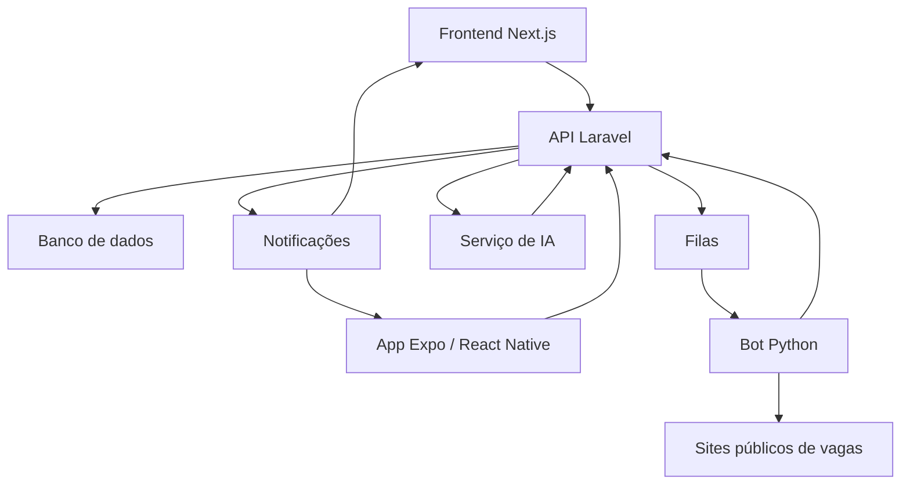
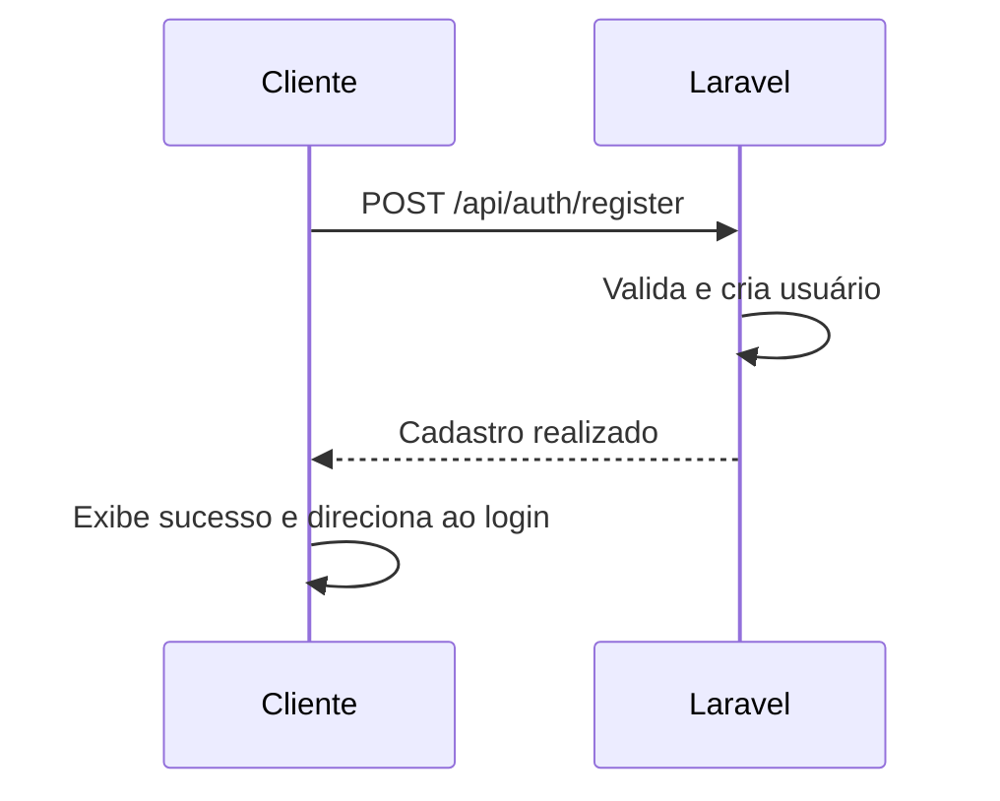
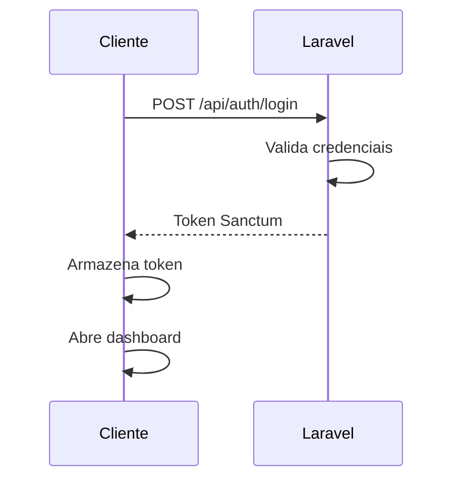
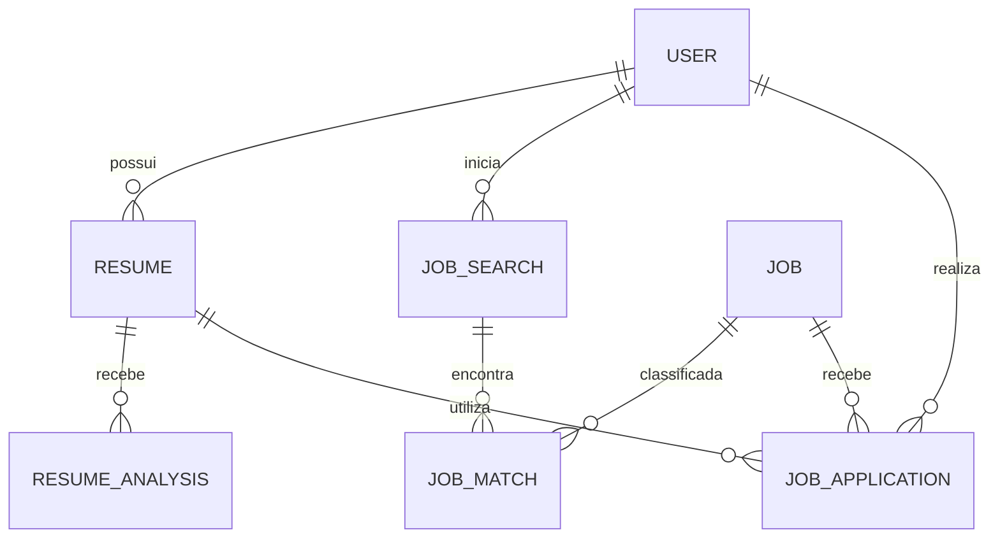

# Arquitetura do Talora Apply

## 1. Objetivo

Este documento descreve a arquitetura inicial do Talora Apply, os limites entre seus componentes e o fluxo das principais operações.

A arquitetura deverá permitir que backend, web, mobile, bot e IA evoluam de forma independente, preservando contratos claros entre eles.

## 2. Visão geral



## 3. Princípios arquiteturais

### Laravel como orquestrador

O Laravel é a fonte oficial das regras de negócio. Ele decide se uma pesquisa ou candidatura pode ser executada, persiste estados e mantém auditoria.

### Processamento assíncrono

Processamento de currículo, pesquisa, classificação e candidatura não devem bloquear requisições HTTP.

### Bot como executor

O bot coleta dados e executa automações previamente autorizadas. Ele não decide planos, limites ou permissões comerciais.

### IA explicável

A IA deverá produzir dados estruturados e explicações. O percentual final precisa estar acompanhado dos fatores que o originaram.

### Idempotência

Reprocessar uma mensagem não pode criar candidaturas duplicadas.

### Independência dos clientes

Next.js e Expo/React Native são aplicações separadas. Ambos consomem a mesma API, mas possuem navegação, armazenamento e interface próprios.

## 4. Componentes

### 4.1 Backend Laravel

Responsabilidades:

- autenticação com Sanctum;
- usuários e perfis;
- currículos e versões;
- pesquisas;
- vagas normalizadas;
- compatibilidade candidato-vaga;
- regras de elegibilidade;
- candidaturas;
- planos e limites;
- filas;
- notificações;
- auditoria;
- API para web e mobile;
- integração com bot e IA.

O backend não deverá executar scraping ou automação de navegador diretamente.

### 4.2 Bot Python

Responsabilidades:

- leitura e extração de currículos;
- busca de vagas;
- captura de páginas públicas;
- normalização de dados;
- validação técnica da possibilidade de candidatura;
- preenchimento de formulários;
- envio de candidatura;
- retorno estruturado do resultado.
- estruturar informações do currículo;
- identificar habilidades;
- interpretar requisitos;
- comparar candidato e vaga;

Cada site deverá possuir um adaptador:

```python
class JobProvider:
    def search(self, filters): ...
    def fetch_job(self, external_id): ...
    def normalize(self, raw_job): ...
    def can_apply(self, job): ...
    def apply(self, job, candidate): ...
```

Os adaptadores isolam mudanças específicas dos provedores.

### 4.3 Serviço de IA

Responsabilidades:

- justificar pontuações;
- sugerir melhorias;
- indicar pontos fortes e lacunas.

A IA não poderá:

- inventar experiências;
- adicionar habilidades não informadas;
- autorizar uma candidatura sozinha;
- substituir validações determinísticas do Laravel.

### 4.4 Frontend Next.js

Responsabilidades:

- interface web;
- autenticação;
- dashboard;
- currículos;
- pesquisa de vagas;
- histórico de candidaturas;
- apresentação das análises;
- configurações;
- internacionalização.

O token deverá permanecer em cookie `HttpOnly`, sem exposição ao JavaScript do navegador.

### 4.5 Aplicativo Expo/React Native

Responsabilidades:

- interface Android/iOS;
- login e cadastro;
- dashboard;
- acompanhamento de processos;
- notificações;
- internacionalização.

O token deverá ser armazenado com `expo-secure-store` em Android e iOS.

## 5. Fluxo de autenticação

### Cadastro



O cadastro não retorna token.

### Login



## 6. Fluxo do currículo

1. Cliente envia o arquivo ao Laravel.
2. Laravel valida e armazena o documento.
3. Laravel cria um processamento.
4. Uma tarefa é publicada na fila.
5. O bot extrai texto e campos.
6. O bot devolve dados estruturados.
7. Laravel persiste o resultado bruto.
8. Laravel solicita a interpretação da IA.
9. A IA devolve habilidades, diagnóstico e sugestões.
10. Laravel persiste a análise e conclui o processo.
11. O cliente é notificado.

Resultados brutos do bot e análises da IA deverão ser armazenados separadamente.

## 7. Fluxo da pesquisa

1. O usuário inicia a pesquisa.
2. Laravel valida usuário, currículo, plano, limites e filtros.
3. Laravel cria `JobSearch`.
4. A tarefa é enviada ao bot.
5. O bot pesquisa os provedores habilitados.
6. As vagas são normalizadas.
7. Laravel elimina duplicidades.
8. IA e Laravel classificam as vagas.
9. Laravel salva `JobMatch`.
10. Vagas acima de 90% podem gerar tarefas de candidatura.

Estados sugeridos:

```text
pending
processing
classifying
applying
completed
partially_completed
failed
canceled
```

## 8. Fluxo da candidatura

Antes de publicar uma tarefa, o Laravel valida:

- compatibilidade superior a 90%;
- autorização do usuário;
- provedor habilitado;
- site sem login;
- ausência de CAPTCHA e MFA;
- vaga disponível;
- dados obrigatórios;
- inexistência de candidatura anterior.

Depois:

1. Laravel cria a candidatura como `queued`.
2. Bot recebe a tarefa.
3. Bot confirma que o formulário ainda é elegível.
4. Bot preenche e envia.
5. Bot devolve evidências e resultado.
6. Laravel atualiza o estado.
7. Usuário é notificado.

Estados sugeridos:

```text
eligible
queued
processing
submitted
skipped
requires_manual_action
failed
withdrawn
```

## 9. Modelo conceitual



Entidades iniciais:

- `User`;
- `UserProfile`;
- `Resume`;
- `ResumeProcessing`;
- `ResumeAnalysis`;
- `JobProvider`;
- `Job`;
- `JobSearch`;
- `JobMatch`;
- `JobApplication`;
- `AutomationPreference`;
- `Notification`.

## 10. Contratos de mensageria

Toda mensagem assíncrona deverá possuir:

```json
{
    "id": "uuid",
    "type": "job.search.requested",
    "version": 1,
    "correlation_id": "uuid",
    "user_id": 1,
    "resource_id": "uuid",
    "attempt": 1,
    "created_at": "2026-07-30T20:00:00Z",
    "payload": {}
}
```

Requisitos:

- versionamento de contrato;
- identificador de correlação;
- chave de idempotência;
- tentativas limitadas;
- retentativa com intervalo;
- fila de mensagens com falha;
- payload mínimo;
- nenhuma senha ou token no payload.

## 11. Compatibilidade candidato-vaga

Possíveis dimensões:

- habilidades obrigatórias;
- habilidades desejáveis;
- experiência;
- senioridade;
- formação;
- idiomas;
- localização e modalidade;
- similaridade semântica;
- evidências presentes no currículo.

Os pesos deverão ser configuráveis e versionados.

Exemplo de resultado:

```json
{
    "score": 84,
    "matched_skills": ["PHP", "Laravel", "MySQL"],
    "missing_skills": ["AWS", "Kubernetes"],
    "strengths": [
        "Experiência relevante em desenvolvimento backend"
    ],
    "weaknesses": [
        "Experiência em cloud não demonstrada"
    ],
    "recommendations": [
        "Detalhar resultados obtidos em projetos Laravel"
    ],
    "model_version": "candidate-job-v1"
}
```

## 12. Segurança

- HTTPS obrigatório em produção;
- tokens protegidos;
- arquivos privados;
- autorização por recurso;
- validação de uploads;
- rate limiting;
- logs sem dados sensíveis;
- consentimento para automação;
- exclusão de dados;
- auditoria das candidaturas;
- nenhuma tentativa de contornar login, CAPTCHA ou MFA.

## 13. Observabilidade

Todos os componentes devem compartilhar:

- `correlation_id`;
- `user_id`;
- identificador do processo;
- tipo da tarefa;
- provedor;
- tentativa;
- duração;
- estado final.

Métricas mínimas:

- tempo de processamento do currículo;
- vagas encontradas por provedor;
- classificações concluídas;
- candidaturas realizadas;
- duplicidades evitadas;
- falhas por provedor;
- custo e tempo da IA.

## 14. Decisões em aberto

- banco de dados definitivo;
- tecnologia de filas;
- protocolo Laravel-bot;
- provedor de IA;
- estratégia de notificações em tempo real;
- armazenamento dos currículos;
- primeiro site de vagas suportado;
- política definitiva de pesos da classificação.

Essas decisões deverão ser registradas conforme ADRs quando forem tomadas.

